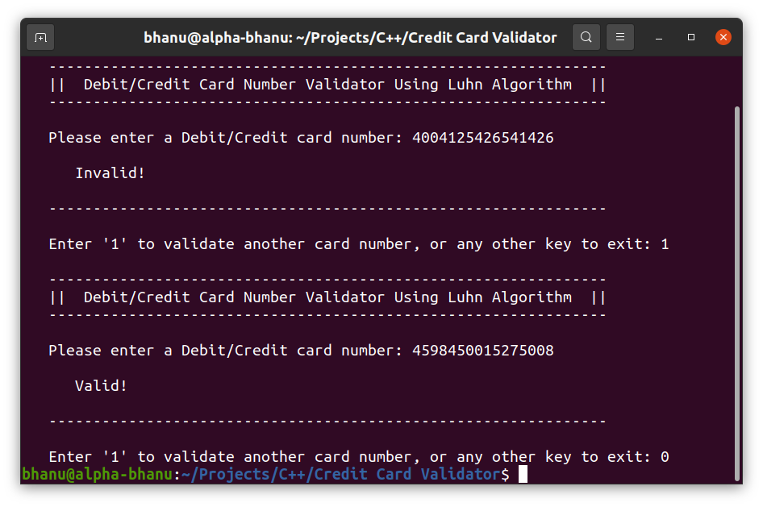

<h2 align="center">
  Debit/Credit Card Number Validator
</h2>

  

 

 &nbsp;

## Description
This is a C++ program built for terminal. It uses Luhn's Checksum Algorithm to validate Debit/Credit card number.

## Getting Started

Fork this repository and clone down on your local machine. You will required `g++` installed on your machine.

## Usage Instructions

1. Open the terminal in Linux/Mac or command prompt in Windows operating system.

2. Navigate to the project directory.

3. Type command `g++ main.cpp` and hit enter.

4. Type executed output file `./a.out` and hit enter.

That's all, now you can use this program.

## Show your support

Give a ⭐ if you like this repository!